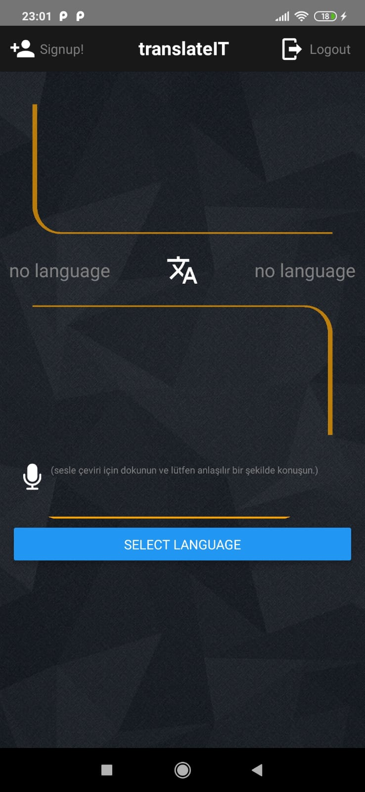
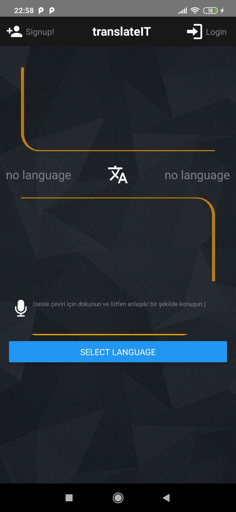
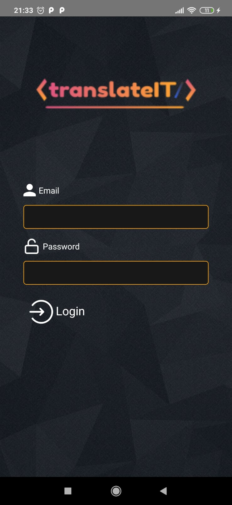
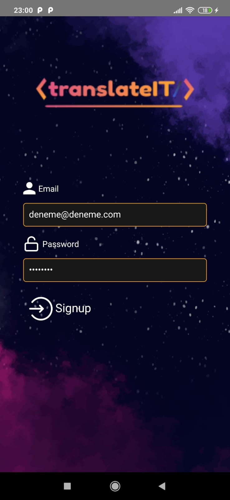
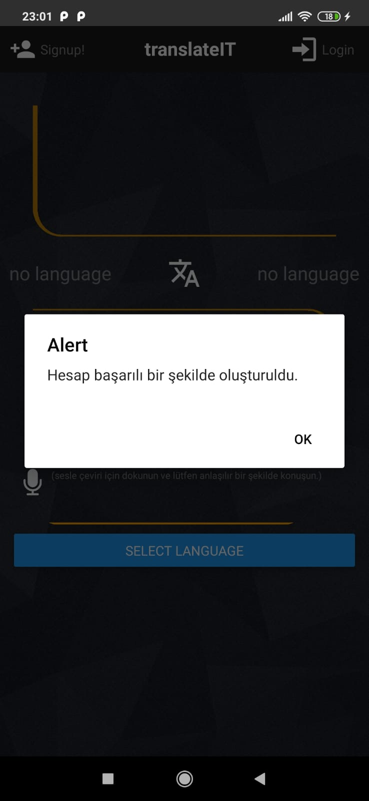
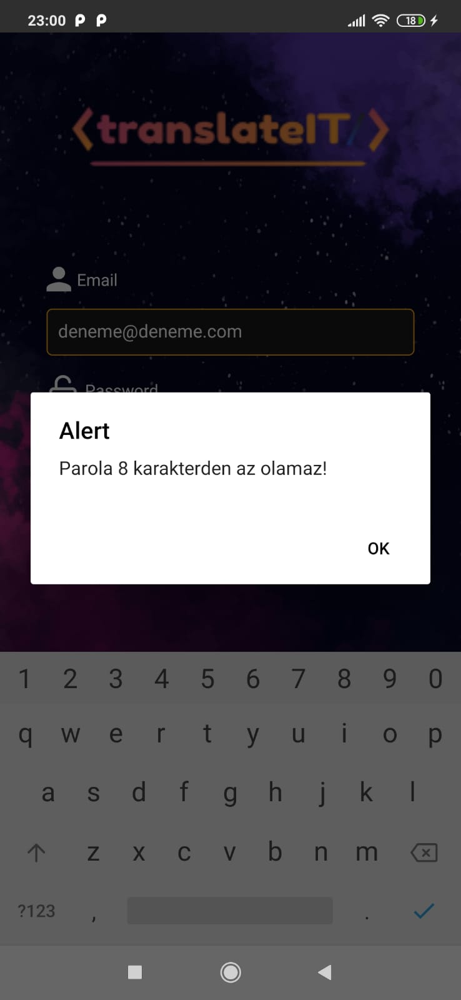

# translateIT

The translateIT is a React Native mobile translate application.

**1.** The Requirements<br>
**2.** Installation for Ubuntu 18.04<br>
**3.** Possible errors<br>
3a. **Error:** Watchman needs your help<br>
3b. **Error:** Activity class does not exist.<br>
**4.** Application screenshots<br>

## The Requirements
NodeJS,
npm,
JDK,
Android Studio,
Watchman,
React Native CLI


## Installation for Ubuntu 18.04

If the requirements are installed


**1)** To the command line:
````
    git clone https://github.com/orkunincili/translateIT.git
````

**2)** Enable Developer Options after that you should enable USB debugging mode in your android device

**3)** Open the project **( /translateIT/android )** with Android Studio and plug your device. Your device name will appear on top. 

**4)** Click the 'Run'.

**5)** Go to the project directory **( /translateIT )**

**6)** to the command line:

````
    react-native run-android && npm start
````
If translateIT doesn't open press 'r' ( in the command line ) for the reload app or you can close the app and re-open.

## Errors:

### Error: Watchman needs your help:
````
    watchmanResponse: {
    version: 'x.x.x',
    error: 'A non-recoverable condition has triggered.  Watchman needs your help!\n' +
      'The triggering condition was at timestamp=1587446022: inotify-add-watch(/home/{user}/translateIT/node_modules/@babel/plugin-syntax-optional-chaining/lib) -> The user limit on the total number of inotify watches was reached; increase the fs.inotify.max_user_watches sysctl\n' +
      'All requests will continue to fail with this message until you resolve\n' +
      'the underlying problem.  You will find more information on fixing this at\n' +
      'https://facebook.github.io/watchman/docs/troubleshooting.html#poison-inotify-add-watch\n'

````
To the command line:
````
   echo 256 | sudo tee -a /proc/sys/fs/inotify/max_user_instances
   echo 32768 | sudo tee -a /proc/sys/fs/inotify/max_queued_events
   echo 65536 | sudo tee -a /proc/sys/fs/inotify/max_user_watches
````
Then:
````
   watchman shutdown-server
````
The output should be like that:
````
   {
    "version": x.x.x,
    "shutdown-server": true
   }

````
After that you can use:

````
  npm start

````
### Error: Activity class {com.translateit/com.translateit.MainActivity} does not exist.

The values must be same in these locations:
````
android>app>build.gradle (applicationId)
android>app>src>main>java>com>app_name>MainActivity.java (package name)
android>app>src>main>java>com>app_name>MainApplication.java (package name)
android>app>src>main>AndroidManifest.xml (package)
````

[More info about this error](https://github.com/facebook/react-native/issues/14952)


## Application screenshots









