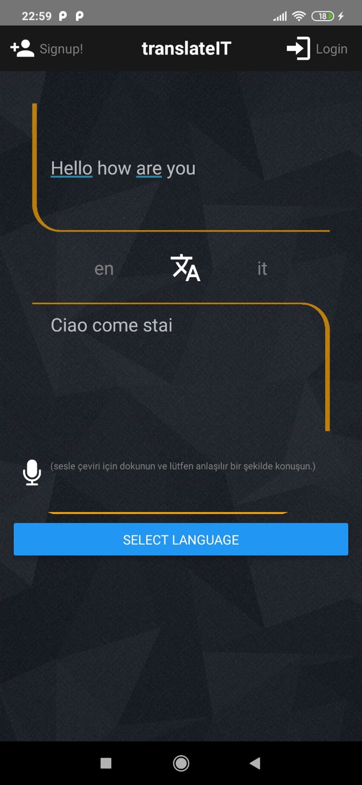
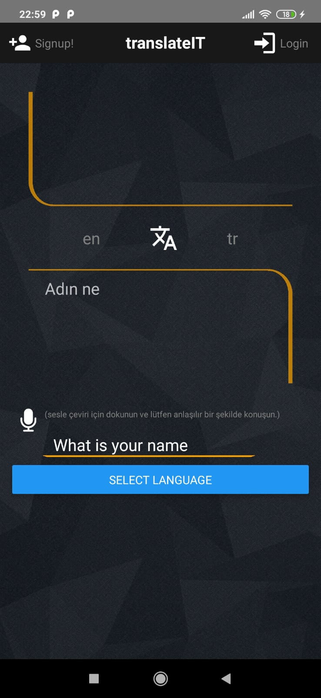

# translateIT

translateIT is a React Native mobile translate application.

## Installation


**1)** To the command line:
````
    git clone https://github.com/orkunincili/translateIT.git
````

**2)** Enable Developer Options after that you should enable USB debugging mode in your android device

**3)** Open the project**(/translateIt/android)** with Android Studio and plug your device. Your device name will appeart on top. 

**4)**The click 'Run'.

**5)**Go to the project directory and to the command line:

````
    react-native run-android && npm start
````
If translateIT doesn't open, close the app and re-open.

**in-app screenshots**







